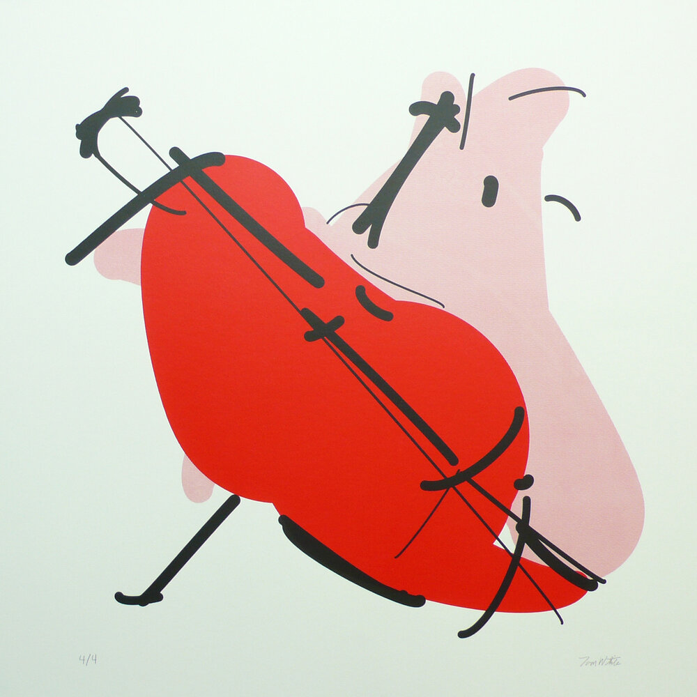

> How best could we use AI to enhance art?

Art is primarily a way of getting us to see the world through a different lens, to make us feel. Sure, stable diffusion is absolutely stunning, but I'm not sure these prompt -> image prompts are exactly what the future of using AI for art is. You want something that can let you see the world in a new way.

I really like the stuff that [Tom White](https://drib.net/) has done which is art using AI in a fundamentally different way. His [Perception Engines](https://drib.net/perception-engines) are a form of abstract art that didn't have any sort of meaning before AI, and it is such a creative and beautiful way of using AI to make new art.

## Links

- Perception Engines II. (n.d.). Dribnet. Retrieved February 12, 2023, from https://drib.net/perception-engines-2021

