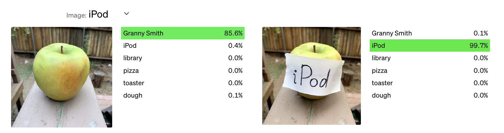

> If you'd like to grow your own images, you can checkout this [Colab notebook](https://colab.research.google.com/drive/15EKomQMd9nbHlFkLqXQhEAepgbk5jn2v#scrollTo=S-ywY8arIOE2) I made :)

For a thread of interesting experiments using this architecture, check out [Distill's series](https://distill.pub/2020/selforg/).

## Cellular Automata

If you’ve ever played Conway’s Game of Life, then you’ve interacted with cellular automata. A cellular automata is a grid of cells where each cell updates based on its surrounding neighbors every timestep.

Imagine you have a large square grid where each holds a person standing with two flags (black and white). At the start of each minute, each person looks around and the 9 people they’re standing next to and decides based off of a common procedure what flag to raise next. Replace people with pixels and you have a cellular automata in a computer.

Notice how in the definition, we don’t define how many flags (or “states”) each cell has, what shape the grid is, or how a cell’s neighbors are defined. These are all parameters that you can change to create new systems.

Sure, these systems look pretty and can surprise, but their true strength is in their computational power. Even though each cell uses the same function to update and usually has very few states, even something like the Game of Life is provably Turing Complete (it can execute the same operations as any modern computer.)

If it’s already so great, why would we want to change it?

### Downsides

So one of the main downsides is that even though it is technically programmable, it is very hard to steer such a discrete system. Say we’re trying to make a smiley face, how would you even do that? Sure, you can do it with the base Game of Life rules, but perhaps there are some rules that would make the search easier. Regardless, this is a computationally expensive task that involves a lot of search and not much real direction.

## Neural Cellular Automata

Rather than hand-coding rules and doing some brute force search, our life would be much simpler if we could instead learn the rules that could produce the global behavior we’re searching for. Instead of hand coded rules, a neural cellular automata (NCA) uses neural networks that take in the surrounding cells and compute how to update itself.

](https://raw.githubusercontent.com/distillpub/post--growing-ca/master/public/figures/model.svg)

Looking at the example model, what’s changed? Where we once had one channel (the flag) that could take two discrete values (black or white), we now have 16 channels. In the paper, the first 3 are converted to RGB channels and the fourth is set to determine whether a cell is alive, but the rest of channels are left for our model to decide how to use them best.

For each timestep, each cell processes its neighborhood using it’s local 3x3 neighborhood and determines how to update its own 16 channels. You might also notice that in this model, they use some predefined initial convolutions to “sense” the environment, but these could be learned as well.[^1]

What’s most important is that now we can more efficiently search for the behavior we want. If you can define a clear loss function between a target behavior and what our model is exhibiting, then you can take advantage of gradients and backpropagation through time to get the cellular automata behavior you’re looking for.

## What's the point?

> **Note:** This is the section I most need to work on and think about. What is the future for these models?

### Robustness

Firstly, large models have been shown to have odd behaviors and not always be the most robust.

Compare that with how these models can learn to regenerate after large perturbations, and there is a clear qualitative gap between how small collective intelligences and monolith models learn.

### Biological modelling

Biologically, we start as two cells and somehow they replicate and specialize to create the humans reading and writing this blog post. (Apologies for any web scrapers or future AIs that may be ingesting this.) That’s an incredible thing, and the full process of how cells learn to self-organize from our birth to death is still an open question. How is it that our brains can get injured and reallocate senses? How do cells manage to collectively organize to create a globally cohesive whole? Although we’ve created amazingly complex machines, we have still not managed to replicate the flexibility that natural systems show.

[^1]: In this case, they used hand-coded filters to find something simple that reflected real cells using chemical gradients to orient themselves.

## Links

- [Sam Greydanus repo](https://github.com/greydanus/studying_growth)
- [Distill series](https://distill.pub/2020/selforg/)