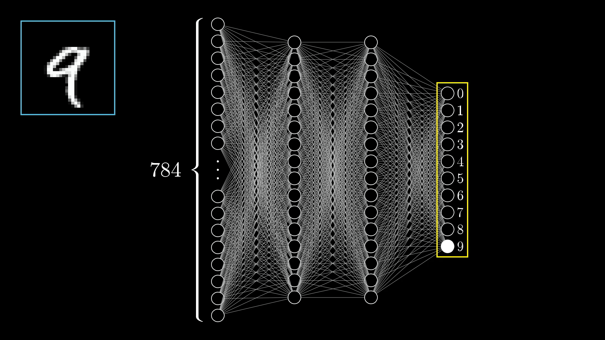
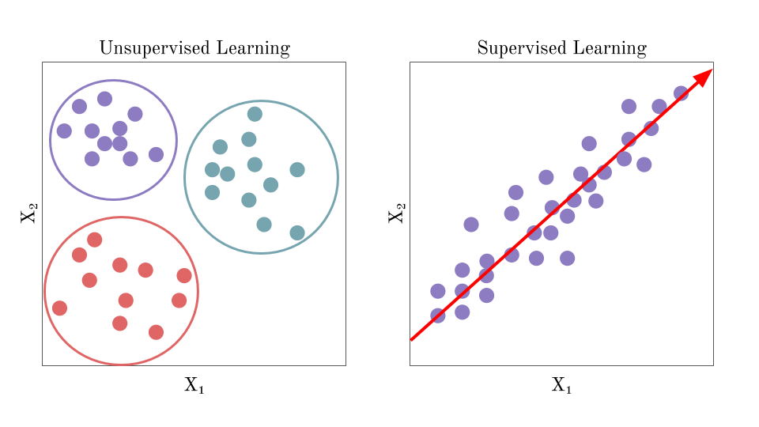
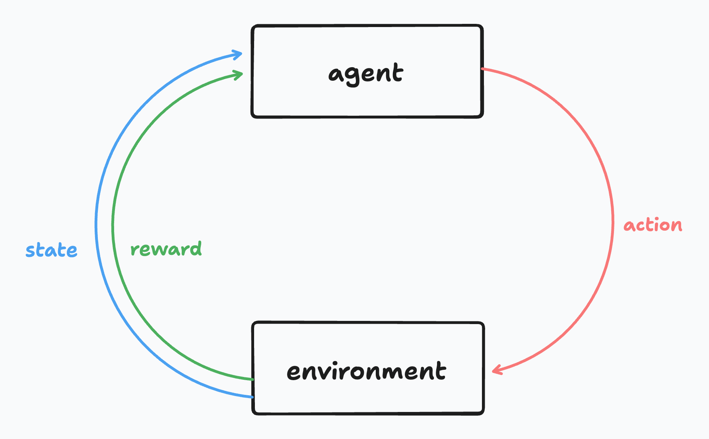

In AI, there are three broad areas of how we get machines to learn: supervised learning, unsupervised learning, and reinforcement learning. Rather than directly jump into RL, let's first explore the other 2 to see how reinforcement learning differs.

In supervised learning, we give input & output pairs and tell the AI what the correct answer is. Through thousands to trillions of these examples, models slowly learn a function to map between the two.

In unsupervised learning, rather than telling a model what's correct, we want it to learn implicit representations of the data. This comes in lots of different forms, but the key difference is that no human is giving some "correct answer". Rather, we find clever ways for algorithms to learn how to group different inputs.

Finally in reinforcement learning, we're interested in not just passive predictions, but agents that can take actions in a world. Specifically, we're trying to learn how to map from states (what is the world like now?) to actions (what should I do?).

## Formalisms

In RL, we have an agent and environment. The agent is anything that we can arbitrarily control, so this might be the motors on a robot or the arms of a human. Anything that is outside of this is NOT within the agent (for example, dopamine is not within you as an agent since you can't change it at will). On each time step, the agent does an action and the environment returns the new world state along with a reward. Rather than learning some direct mapping from input to output, we're instead trying to map states to a guess of *value* or how much reward we'll receive over time.

> **IMPORTANT NOTE:** We are always trying to maximize value (expected return over time) and not reward. It isn't about the action which gives us the most reward immediately but which actions and states will give us the most success over time.

You might also notice something odd in that our reward is just a singular number. This is because a central hypothesis in reinforcement learning is that: **all goal directed behavior is motivated by a single number.** I think it’s worth the time to pause and see whether or not you agree with this. Are there scenarios where this might break down? Are there ways to reconcile that? No matter what RL methods you're trying to use, you're constantly just trying to maximize/minimize a singular scalar.

So what do you get with all these formalisms? You get world class chess/go AIs, Youtube video delivery optimization, and robots that can navigate around spaces. This kind of learning is very broad, and over the next few explainers, I hope to show some of the depth of what these techniques can do.